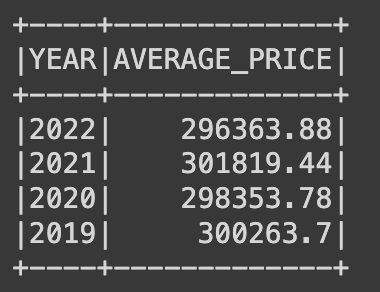
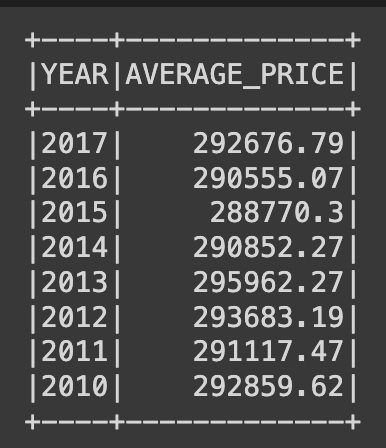
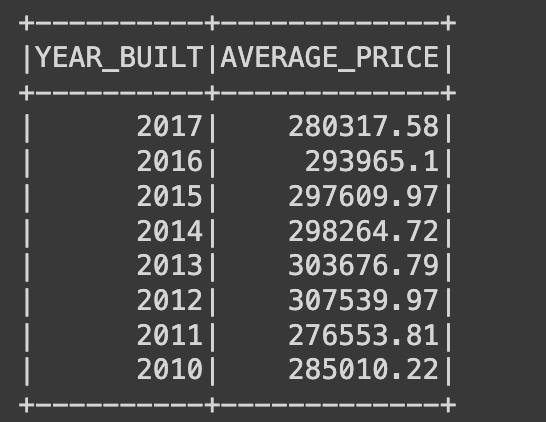
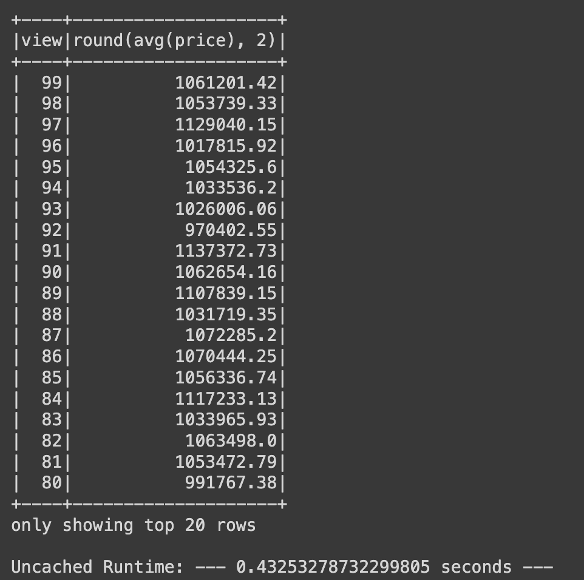

# Home Sales Analysis
This repository contains the analysis of home sales data using PySpark SQL. The analysis includes various queries to derive insights from the dataset.

## Files
- `Home_Sales.ipynb`: Jupyter Notebook containing the PySpark SQL analysis.
- `README.md`: This file, providing an overview of the repository.

## Features in the Project
The analysis includes the following tasks:
1. Average price for a four-bedroom house sold for each year.
2. Average price of a home for each year built, with three bedrooms and three bathrooms.
3. Average price of a home for each year built, with specific attributes (three bedrooms, three bathrooms, two floors, and greater than or equal to 2,000 square feet).
4. Average price of a home per "view" rating with average home price greater than or equal to $350,000. The runtime for this query is also determined and compared to the uncached runtime.
5. The temporary table 'home_sales' is cached, and caching is verified.
6. The last query is rerun using the cached data, and the runtime is determined and compared to the uncached runtime.
7. The dataset is partitioned by the "date_built" field, and a temporary table is created for the parquet data.
8. The last query is rerun using the parquet temporary table, and the runtime is determined and compared to the uncached runtime.
9. The temporary table 'home_sales' is uncached, and uncaching is verified.

## Report
- What is the average price for a four-bedroom house sold for each year? Round off your answer to two decimal places.

- What is the average price of a home for each year the home was built, that has three bedrooms and three bathrooms? Round off your answer to two decimal places.
 

- What is the average price of a home for each year the home was built, that has three bedrooms, three bathrooms, two floors, and is greater than or equal to 2,000 square feet? Round off your answer to two decimal places.

- What is the average price of a home per "view" rating having an average home price greater than or equal to $350,000? Determine the run time for this query, and round off your answer to two decimal places.

## Author
- ASHLIN SHINU GEORGE

